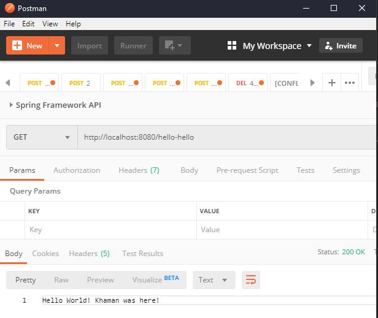

# Mission 1

1. Using Spring Initializr (https://start.spring.io/), create a new project:
    - Java 11
    - Maven
    - Spring Boot 2.2.4
    - Dependencies: Spring Web
2. Create a basic simple GET endpoint that returns a "hello world" string.
    - Refer to https://dzone.com/articles/hello-world-program-spring-boot

3. Run your application, verify the hello-world endpoint using Postman.
  ```
   mvn clean install
   mvn spring-boot:run
  ```
  
 
 # Mission 2
 
1. Choose a theme from the following:
     - Pet Store
     - Music Store
     - Game Store
     - or a store of something  
 ``I choose Book Store`` 
2. Create models for your store using [Lombok](https://www.baeldung.com/intro-to-project-lombok)
3. Create a global list to persist your data in memory.
4. Create CRUD endpoints that return in content type "application/json"
    - One POST endpoint to add item to your global list.
    - One GET endpoint to retrieve items from your global list.
    - One PUT endpoint to update item in your global list.
    - One DELETE endpoint to delete item from your global list.

    Sample of CRUD:
    <table>
    <tr><th>CRUD</th>
    <th>REQUEST</th>
    <th>RESPONSE</th>
    <tr>
    <td>
    <pre>
    <br/><br/><br/>POST /v1/car <br/><br/><br/><br>
    </pre>
    </td>
    <td><pre>
    json
    {
        "name": "Tesla",
        "type": "EV"
    }
    </pre></td>
    <td><pre>
    HTTP 200
    {
        "id": 1,
        "name": "Tesla",
        "type": "EV"
    }
    </pre></td>
    <tr><td><pre><br/><br/><br/>GET /v1/car<br/><br/><br/><br>
    <td>
    n/a
    </td>
    <td><pre>
    HTTP 200
    {
        "vehicles": [
            {
                "id": 1,
                "name": "Tesla",
                "type": "EV"
            }
        ]
    }
    </pre></td>
    <tr><td><pre><br/><br/><br/>PUT /v1/car/{id}<br/><br/><br/><br>
    <td><pre>
    json
    {
        "name": "Tesla",
        "type": "EV",
        "isFavourite": true
    }
    </pre></td>
    <td>
    HTTP 200
    </td>
    <tr><td><pre><br/><br/><br/>DELETE /v1/car/{id}<br/><br/><br/><br>
    <td>
    None
    </td>
    <td>
    HTTP 200
    </td>
    </table>

    > Nouns: 
    > - Title
    > - Author
    > - Genre
    > - Price
    > - Rating
  
    > Verbs:
    > - Add book
    > - View book
    > - Give rating
    > - Update price
    > - Delete book 
5. Run your application, verify the CRUD endpoints using Postman/curl.  
   - Postman 
        - Import the postman collection
        - Try to send all request
   - Curl
        - `curl -I -X POST http://localhost:8080/book/generate`
        - `curl -s -X GET http://localhost:8080/books | jq`
            ```json
            [
                {
                    "id": 0,
                    "title": "Elon Meow",
                    "author": "Khaman",
                    "genre": "Documentary",
                    "price": 1010.1,
                    "rating": 100.0
                },
                {
                    "id": 1,
                    "title": "1",
                    "author": "1",
                    "genre": "Math",
                    "price": 1.0,
                    "rating": 1.0
                }
            ]
          ```
        - `curl -H "Content-Type: application/json" -d "{ \"id\":2, \"title\": \"tajuk\", \"author\": \"penulis\", \"genre\": \"jenis\", \"price\": 123.11, \"rating\": 10 }" http://localhost:8080/book/create`
        - `curl -s -X GET http://localhost:8080/book/2 | jq`
            ```json
            {                     
              "id": 2,            
              "title": "tajuk",   
              "author": "penulis",
              "genre": "jenis",   
              "price": 123.11,    
              "rating": 10        
            }
          ```
        - `curl -I -X PUT http://localhost:8080/book/edit/price/0?price=777.77`
        - `curl -I -X PUT http://localhost:8080/book/edit/rating/0?rating=99`
        - `curl -s -X GET http://localhost:8080/book/0 | jq`
           ```json
          {
            "id": 0,
            "title": "Elon Meow",
            "author": "Khaman",
            "genre": "Documentary",
            "price": 777.77,
            "rating": 99
          }
          ```
        - `curl -I -X DELETE http://localhost:8080/book/delete/2`
        - `curl -s -X GET http://localhost:8080/books | jq`
            ```json
           [
               {
                   "id": 0,
                   "title": "Elon Meow",
                   "author": "Khaman",
                   "genre": "Documentary",
                   "price": 777.77,
                   "rating": 99.0
               },
               {
                   "id": 1,
                   "title": "1",
                   "author": "1",
                   "genre": "Math",
                   "price": 1.0,
                   "rating": 1.0
               }
           ]
          ```
6. Check in your source code in your GitHub repo.


Personal Note/ Lesson Learned:
1. Ambiguous Mapping - One URI one method. Use [method chaining](https://stackoverflow.com/questions/7428039/java-constructor-method-with-optional-parameters) to overcome.
2. `@Component` is general one. Specialized :- `@Controller`, `@Service`, `@Repository`.
3. `@RequestMapping` is general one. Specialized :- `@Get/Post/Put/Delete-Mapping`.
4. `@PostConstructor` is not supported on JDK 11
5. TODO: https://www.baeldung.com/exception-handling-for-rest-with-spring
