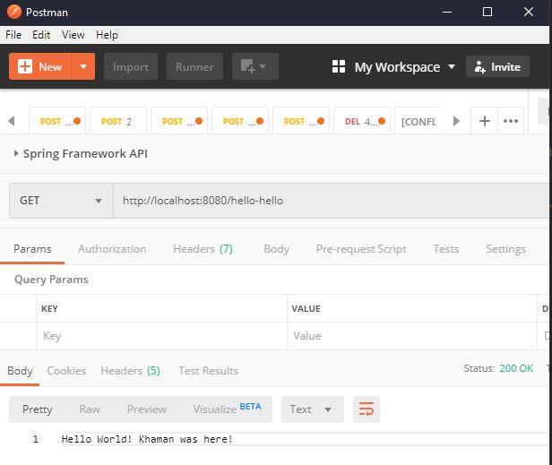

# Mission 1

* Using Spring Initializr (https://start.spring.io/), create a new project:
    - Java 11
    - Maven
    - Spring Boot 2.2.4
    - Dependencies: Spring Web
* Create a basic simple GET endpoint that returns a "hello world" string.
    - Refer to https://dzone.com/articles/hello-world-program-spring-boot
* Run your application, verify the hello-world endpoint using Postman.
  ```
   mvn clean install
   mvn spring-boot:run
  ```
  
 